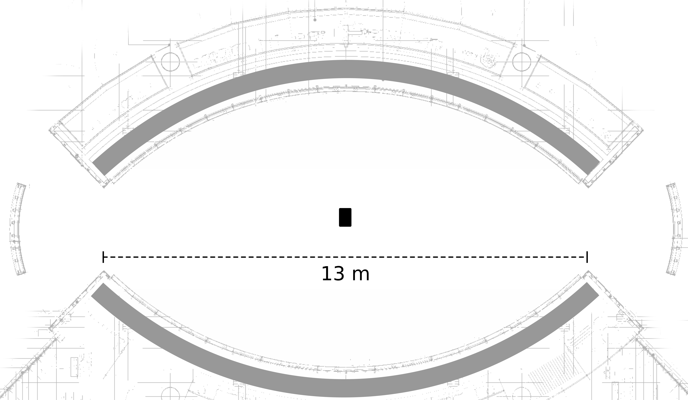

# About the System

## Concept

The Ethnomusicology Museum at the newly built
[Humboldt Forum](https://www.humboldtforum.org/en/) features a listening room for immersive
illustration of relevant auditory content.
It is unique in that it combines multiple methods for sound field synthesis,
mainly Wave Field Synthesis (WFS) and Higher Order Ambisonics (HOA), thus
providing an enhanced spatial experience.
A dedicated software system, developed by the [Audiocommunication Group](https://www.ak.tu-berlin.de/menue/fachgebiet_audiokommunikation/)
at TU Berlin, allows a seamless integration of these methods.

## Loudspeaker Configuration

The listening room features 32 WFS panels by [Four Audio](http://fouraudio.com/en/products/wfs.html). This results in a total of 256 WFS channels, using 768 tweeters and 64 woofers.  Both arcs hold 16 panels each, mounted as a continuous ribbon above head height with  a  horizontal  speaker  distance  of 10 cm.   45 Genelec 8020C speakers are arranged  in  three  levels  on  each  arc,   used  for Ambisonics rendering.

{: style="width:500px"}

*Top view of the listening room with the entrances (left,right) and two
arcs, each with a ribbon of WFS panels (gray).*

---

{: style="width:600px"}

*Side view of a single arc with the ribbon of WFS panels (gray) and the Ambisonics speakers (black).*

---

## Fundamentals of Spatialization

#### The Virtual Sound Source

The combined system works with so called *virtual sound sources*, also referred
to as the object oriented approach of sound spatialization.
The figure below shows the model of such such a virtual sound source,
which is defined by its position, using two angles, the distance and a source width.

{: style="width:400px"}

Every sound event in a project or composition can be connected to such a virtual sound source,
allowing to place it in the listening space.
Depending on the preferred workflow, different tools can be used for a dynamic
arrangement of the individual sound sources.
The provided tools in [Reaper](reaper/) grant a quick entry
by providing control through simple automation trajectories in a DAW project.

#### The Send-System

In addition to the position of the virtual sound source,
the proposed approach also allows the continuous fade of
sound events between the Ambisonics and the WFS rendering
through a send system.
