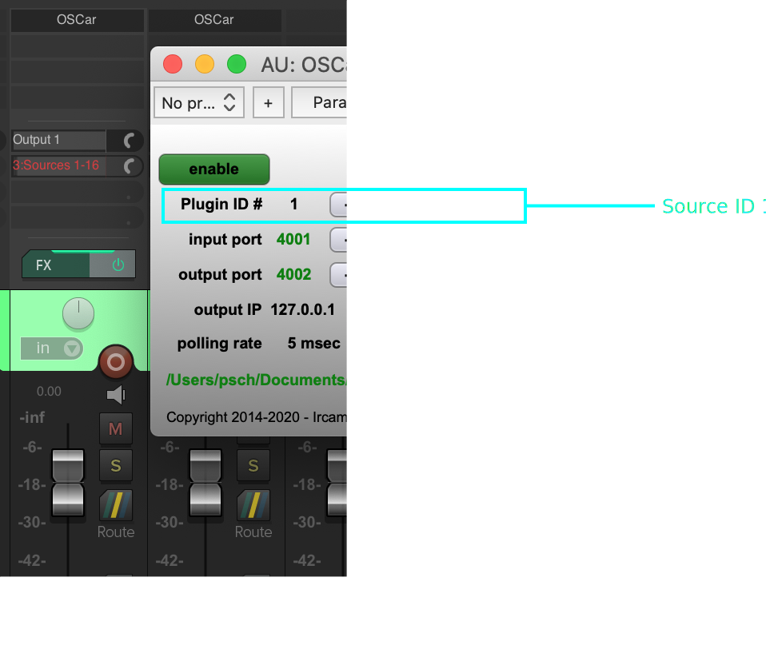
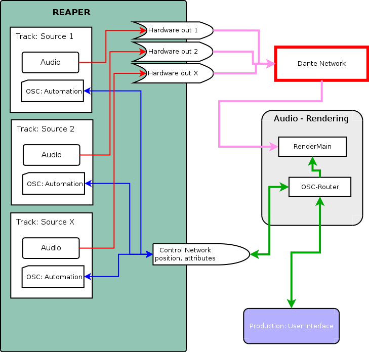
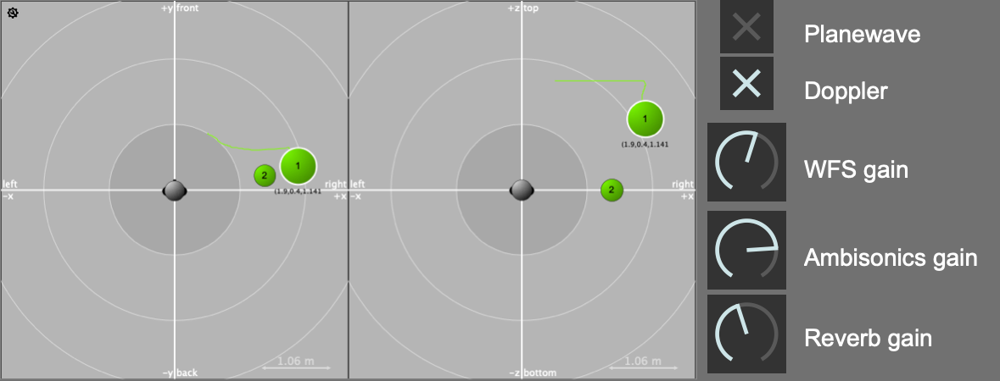
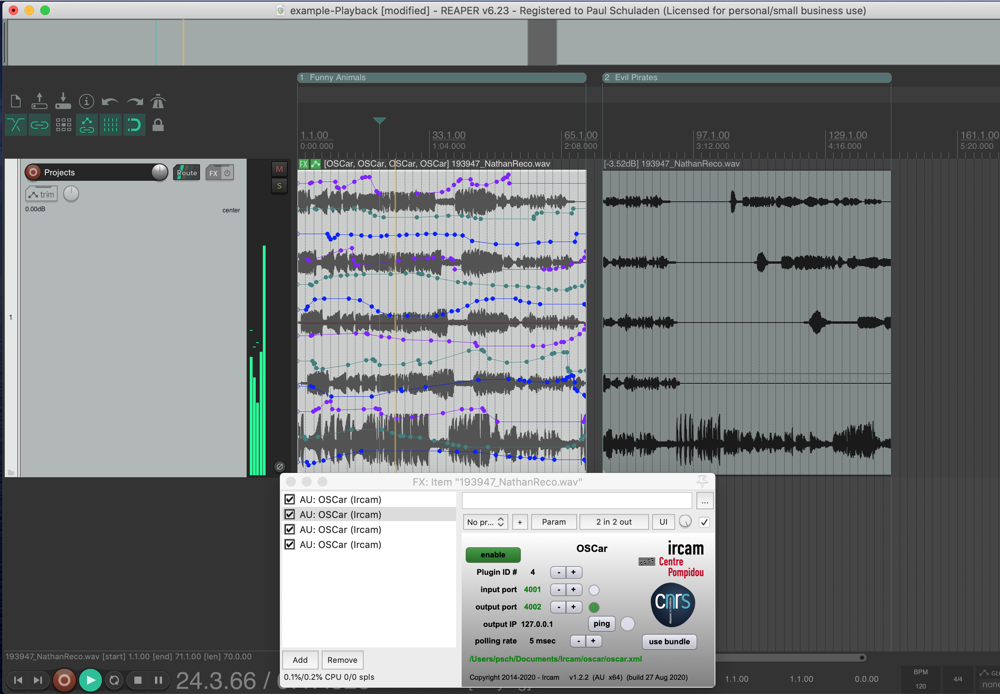

# Working with Reaper

The most accessible way of using the SeamLess system is a single DAW session from a laptop, just as working with any other multi-track audio project.
Reaper is used as the standard software in most projects and recommended.
Other solutions are possible but not fully tested.
Each audio track in a Reaper project is directly routed to the system with DANTE
and connected to a virtual sound source.
Source position and additional properties can be
controlled and automated as any other parameter.
This workflow ensures that content can be prepared in advance and ported
to the system afterwards.

---

## Audio-Sources in general

An audio-source in a spatial audio-system is defined by the audio content and the source attributes, like the position of the source. Depending on the used rendering-module in the HuFo-System (WFS, Ambisonics, Reverb) additional attributes can be defined, e.g. *plane wave* and *Doppler effect* for the WFS module.

The rendering modules are running parallel for all sources. Which rendering module is used can be determined with the additional "send to" parameters, which control the amount of the audio-signal being sent to a specific rendering module. In that way a fades from on to another system as well as mixtures can be realized.

By definition all Audio-Sources are Mono-Audio sources and best results in spatial precision are achieved by sending all audio-element to a single audio source. Of course stereo or other multichannel material can be used too, by using audio sources as virtual speakers which are rendered by the system.

---

## Audio Sources  in REAPER

For defining an audio-source in REAPER, a Plugin is used for sending the source attributes via OSC synchronized to the audio playback (here OSCar by IRCAM is used).
Every audio source is identified by an ID (1-64) which is set in the plugin and corresponds to the channel the audio is sent out. This also means every instance of the plugins represents one audio source.
The output of the audio tracks should be set be sent to a mono channel, either as direct hardware output or if you are using bus-systems to a mono channel on the bus-track.

---

{: style="width:500px"}

---

{: style="width:500px"}

---

{: style="width:500px"}

---

## Content Production Process

{: style="width:500px"}

In the production process the automation data can either be written with the pencil tool inside of REAPER. Also a dedicated interface-client or hardware controllers can be used, which connect also to the central OSC router. The OSC messages are then distributed to the REAPER-plugin where it can be written using the Reaper's automation modes.

**Since it is not defined which state the sources have at the beginning of the playback all source-attributes must be set at the beginning of the project.**

For more information about the OSC-Data have a look in the chapter OSC-Router.

{: style="width:700px"}

---

## Content Playback

The result of a production is a multichannel audio file in which the plugin automation data will be embedded with REAPER's Take FX function. This file including the automations will be saved in Reaper Project Bay from it then can be pasted and arranged in a playback project.

For the project-export a Reaperscript is provided which automates the rendering and data-embedding process.

